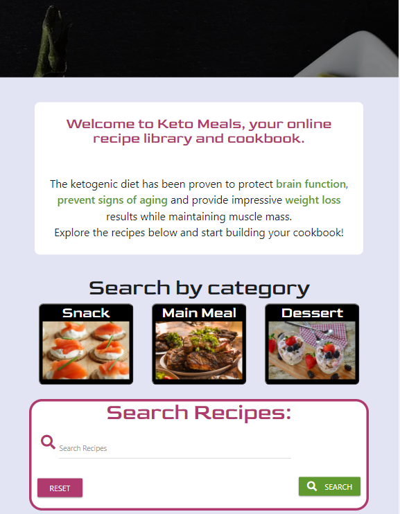
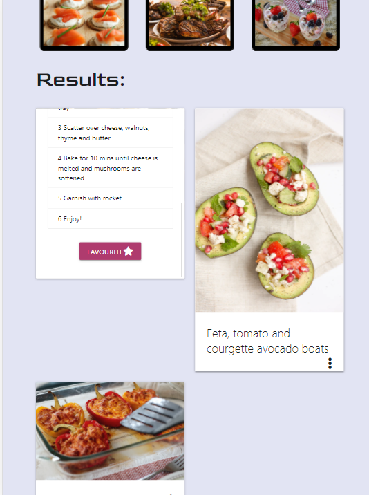
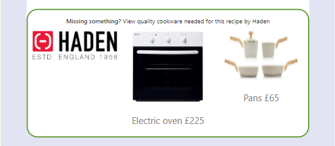
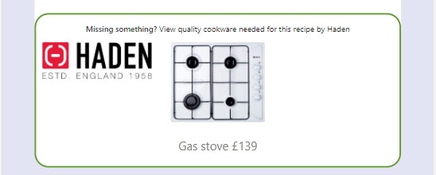

# **KetoMeals**
https://ketomeals-project.herokuapp.com/

This project provides a way of creating an online cookbook for people wishing to follow a ketogenic diet. 
The ketogenic diet is helpful to people with weight and insulin issues, so it is often recommended therapeutically
 and people looking into it are likely to need assistance when coming up with meal plans as it is usually a 
 considerable lifestyle change. Seeing as the rate of obesity is high in the UK, it is likely this market will 
 remain relevant for the future. The value for the user is that they are able to view recipes from other keto diet
  followers which is useful when starting and they are also able to share their own recipes. The value for the 
  site owner would be the ability to advertise the promoted brand of cookware.

The project consists of 5 pages. When a user first visits the site, the pages available to them will be the homepage and register/login page.
 On registering/logging in they will gain access to the my recipes, add recipe and logout button.
 The homepage gives the user the chance to understand the types of recipes available and the aim of the ketogenic 
 diet. The search capabilities are flexible allowing users to search either by meal type or by recipe or ingredient name. 
 The register page allows users to create an account for the site. After registering the user is directed to their
  profile page (my recipes), here they are invited to add a recipe, which will become available for all users to view. 
 Only the user is able to edit or delete the recipe. When browsing recipes, users can decide to add their favourites to
  their personal page for easy viewing. 

## **User Stories & UX**

### **Overall design**
1. Viewing several popular recipe sites gave me an idea of the styling conventions for online cookbooks.
 It is clear users only want to see an image of the recipe and name while searching. When a recipe is selected ingredients and steps are presented simply, making the recipe easy to follow. 
 Bright colours are used sparingly with most focus on the recipe images.
 Websites used for inspiration:
[BBC good food](https://www.bbcgoodfood.com/recipes), [Delicious magazine](https://www.deliciousmagazine.co.uk/recipes/), [All recipes](http://allrecipes.co.uk/recipes/)

2. The color palette was created with [coolors](https://coolors.co/), I chose this palette as the lighter colours will ensure focus remains on the images. The brighter colours draw attention to important parts of the page for easy navigation and give the page more vibrancy.
[Palette Used](https://coolors.co/274c77-af3b6e-d8ddef-60992d-ffffff)

### **User Stories**
1. I am new to keto lifestyle and want to know why I should follow this and what would be available to me.
2. I am following a keto diet and need ideas on what to cook which I can access quickly and easily
3. I am following a keto diet and want to see if the site has recipes for a specific ingredient I want to use
4. I am a follower of the keto diet and want to share my recipes and update them if I’ve found a better way to make them
5. I am the site owner and would like to promote Haden cookware

### **Wireframes**

Wireframes created for this project:
* [Homepage](documentation/wireframes/home.png)
* [Add Recipe and Edit Recipe pages](documentation/wireframes/add_edit.png)
* [Register and Login pages](documentation/wireframes/register_login.png)
* [My recipes page](documentation/wireframes/user_recipes.png)

### **Database Schema**

Mongodb was used as host for the database. I chose this as I wanted the app to be capable of storing a large
amount of data. 
The three collections in the database are: Users, Recipes and Types 
* __Recipes collection__ contains all recipes created. Each recipe has 8 fields, two generated automatically( id_ by mongodb, and created_by, corresponds to the user who created the recipe, their username is used). Recipe id, used to edit, delete and add the recipe as a favourite. 
    The meal_type corresponds to the type collection and only meal types featured in the type collection are given as an option when a recipe is created.
* __Users collections__ contain their username, hashed password and an array of favourites. Favourites arrays are made up of the recipe’s object ids.
* __Type collection__ contains three meal types and recipes can only be created with a meal type featured in the type collection.

### __Users__

| Field names    | Datatype     |
| :------------- | :----------: | 
| _id            | ObjectId     |
|  username      | string       | 
| password       | string       |
| favourites     | array of ObjectIds  |

### __Types__
| Field names    | Datatype     |
| :------------- | :----------: | 
|  _id           | ObjectId     | 
|  meal_type     | string       |

### __Recipes__
| Field names    | Datatype     |
| :------------- | :----------: | 
|  _id           | ObjectId     | 
|  meal_type     | string       |
| recipe_name    | string       |
|  ingredients   | string       | 
|  instructions  | string       |
| cookware       | string       |
| image_url      |   string     |
| created_by     |    string    |

## **Features**

### __Defensive Programming and security features__
* Forms cannot be submitted unless all fields are correctly filled in 
* Login form mistakes are not accredited to "Incorrect password" or "Incorrect username" specifically to ensure people don't
 use this to hack into others accounts.
* All users who wish to post to the site must have an account, no links to create, edit or favourite recipes
 are available to users who do not have an account.
* Accounts are secured using werkzeug so only hashed versions of the passwords are stored.
* My recipes pages use the users specific cookie to load the correct profile so it can only be accessed by the user
 when logged in.
* A logged in cookie is also used so if an anonymous user types in the correct url for the add/edit recipe pages they 
are redirected to the login page with a message above the form saying "You need to be logged in to add/edit a recipe".
* Recipes created by a user can only be edited or deleted by that user or the site admin so recipes can’t be 
tampered with by any other users.
* Recipies can only be favourited once by a user preventing unnecessary build up in their my recipes page.

### **Sitewide Features**

* __Navigation bar__ is dark to compliment both the lighter site colour theme and image backgrounds.
Bar is collapsible and appears as a bar icon on smaller screen sizes. Navigation shows the "Register", "Login" 
and homepage links to user's who aren't logged in. For registered users, the links are "My recipes", "Add recipe",
"Home" and "Logout".
* __Cookware promotion__ appears below most recipes. A selection of cookware from the brand Haden is 
displayed based on the cookware required for the recipe. The cookware is displayed through an image link,
name of product and price. When selected, the user is directed to the amazon purchase page for the product.
Where the recipe contains none of the promoted products, the users will still see the Haden logo and link to
visit the store. The promotion style is simple and subtle, a white background with a bright green border is 
used to make it stand out and seperate it from the recipe.

### **Homepage**

* __Header image__ is a simple colourful image of keto food. The image is overlayed with a black translucent cover featuring the brand name appearing in a large white font. 
The header introduces the site and gives the user an idea of what to expect.
* __Introduction text__ welcomes the user to start creating their cookbook. The benefits of the keto way of eating is described briefly and users are invited to view the recipes.
The text is intended to inform users who are not familiar with the keto diet and entice them to explore further.
* __Meal Type selector buttons__ are the first method of exploring the recipes. Buttons for each meal type allow the user to select the meal type they want to explore
and view relevant recipes. The buttons are made up of a large image, showing an example of the meal type and a heading. Background color is dark to draw attention against the lighter
colour scheme and keep the main focus on the images.
* __Meal Type results__ are displayed below the buttons, in the form of cards. Cards show the recipe image and title only until selected,
once clicked on, an overlay containing the recipe, ingredients appears and a favourite button for logged in users. This allows users to view more than one recipe at a time.
* __Search bar__ allows users to search for recipes by ingredient or recipe name. 
* __Search results__ are displayed as a list of collapsibles with the recipe name and image appearing side by side. Once 
recipe is selected, the drop down reveals the recipe and relevant cookware promotion. This section also contains different buttons 
depending on the identity of the user. If the user is the recipe owner, they have the option of "Edit" or "Delete"; while other users
will see a "favourite" button, used to add the recipe to their personal page.

### **Register/Login Pages**
* __Image background__ is of a wooden table with a knife and fork and a form centered in the middle. The image motivates
the user to sign up and start cooking. 
* __Form__ uses a translucent black background to fit with the image but remain readable. The register form allows the 
user to choose an alphanumeric username and password. When the form is submitted, the user's username, hashed password and 
an empty favourites array are added to the database. If the form is incorrectly filled the input fields will be highlighted
in red to alert the user. The login form allows the user to sign in to their account, if the users input doesn't match with
a user in the database they will be shown a message telling them the username or password is invalid.

### **My Recipes** 
* __User Header__ is styled with site theme colours and welcome the user to their personal page.
* __Own Recipes__ show the recipes the session user has generated with the option of updating or deleting them. The recipe is styled
simply so it's easy to follow. The recipe image and name are shown on top, then ingredients and cookware are displayed through
bullet point lists in site theme colors. Ingredients appear as a collection in seperate boxes, again for ease of reading. Lastly 
the cookware promotion is seen.
* __Favourite Recipes__ are displayed with the same layout for consistency but contain a button to remove the recipe 
from the user's favourites.
* __Security__ Page is loaded using a session cookie created when logging in so anonymous users will not be able to open the page.

### **Add Recipe**
* __Image Background__ is a bright image of a selection of food, making the page vibrant will envoke a positive response from the user and motivate them to complete the form.
* __Form__ is used to add a recipe to the database and is styled using site theme colours. Form contains a field for each recipe requirement in the database. For longer input, such as in ingredients or instructions, expected input 
is explained through helper text below the input field. All fields must be filled out for the recipe to be submitted and incorrectly filled fields will be highlighted in red so the user understands what needs correcting.
* __Security__ If an anonymous user tries to open this page by typing the url, they will be redirected to the log in page with a message saying "Please log in to add a recipe".
### **Edit Recipe**
* __Image Background__ is the same image as the add recipe page so form is easily recognised by the user.
* __Form__ is used to update a recipe in the database and is styled using site theme colours. The form's input fields are prefilled with the current recipe data, allowing the user
to easily make adjustments to the recipe. 
* __Security__ If an anonymous user tries to open this page by typing the url, they will be redirected to the log in page with a message saying "Please log in to edit a recipe".

## Features left to implement
* Comment section for each recipe so users can leave reviews.

## Technologies used
* __HTML__ was used to build all templates.
* __CSS__ was used to style the HTML.
* [__Balsamic__](https://balsamiq.cloud/#) was used to create the wireframes for the project.
* __Javascript__ was used to add responsive features.
* [__Materialize__](https://materializecss.com/) grid was used for page structure. Components were also used to display data.
* __Jquery__ was used to make materialise components functional and simplify javascript.
* __Python__ was used to write the logic for the app.
* __Mongodb__ was used to hold the database for the project.
* __Flask and pymongo__ was used to create the app and connect to the database.
* __Jinja__ templates were used to create and structure page content.
* __Werkzeug__ was used to encrypt and check password inputs.
* [__Fontawesome__](https://fontawesome.com/) was used to add icons throughout the site.
* [__Googlefonts__](https://fonts.google.com/) was used for the main font throughout the site.
* [__W3C Validator__](https://validator.w3.org/) was used to check HTML for errors.
* [__Jigsaw__](https://jigsaw.w3.org/css-validator/) was used to check CSS for errors
* [__PEP8__](http://pep8online.com/) was used to check python code for errors.
* [__Free formatter__](https://www.freeformatter.com/) was used to format HMTL.

## __Testing__

All code was put through validators (listed above) and passed with no errors.
Except for an error on the edit and add page which is outlined in the "Bugs to be fixed" section below.

### __Testing is user stories needs are met__

1. __I am new to keto lifestyle and want to know why I should follow this and what would be available to me.__
    * Homepage has a brief explanation about the benefits of following a ketogenic diet. Directly below are the meal type 
    selector buttons where a user can see what their meals might look like, they can also use the search bar to see if the 
    database contains their favourite foods.
    

2. __I am following a keto diet and need ideas on what to cook which I can access quickly and easily__
    * Users are able to view recipes on the homepage by the meal type they want to make right now or by searching the ingredient they want to use
    * While browsing, registered users 
    also have the option of saving the recipes they like to their favourites, which appear on their personal 
    page. This allows users to create their own personalised cookbook full of their favorite recipes, for immediate access when logging in. 

    

    * Users are also able to remove any recipe from their favourite.
    

3. __I am following a keto diet and want to see if the site has recipes for a specific ingredient I want to use__
    * The search bar is located on the home page, users have the option to search for recipes by ingredient or by name of the recipe.

4. __I am a follower of the keto diet and want to share my recipes and update them if I’ve found a better way to make them__
    
    * On logging in to the site the user is able to share their recipes, either through the “add recipe” button on the navigation or on their personal page.
    * On the users personal recipe page, alongside every recipe is an edit or delete button, if a user decides they want to update or remove a recipe all together.
5. __I am the site owner and would like to promote Haden cookware__
    
    
    * On every recipe, based on the cookware specified, adverts will appear at the end showing the relevant Haden cookware. Adverts contain the Haden logo, 
    an image, name of the product and lead to the purchase page of the product on Amazon when pressed.
    * Seeing as the adverts appear on every recipe both registered and guest users will be able to see them.

### __Testing Functionality and Responsive design__

#### __Site Wide Features__
* __Navigation bar__ : to test this I manually pressed each link on the nagivation page, both as 
an anonymous user and as an existing user as the links avaliable are different. I did this on both
large screen version of the site and mobile to ensure the toggle menu was working well.
    * Functionality: Before logging in:
        * I clicked on the Register link which led to the registration page. Then I pressed the home link and was taken to the homepage.
        * I clicked on the Login link which led to the login page. From this page I selected the home link and was taken to the homepage.
    * Functionality: After logging in:
        * Landed on the my recipes page. Pressed the home link and was taken to the homepage. 
        * From the homepage, I selected the my recipes page and was redirected as expected. 
        * Next I selected the add recipe link which led to the correct page when pressed.
        * Lastly I selected the logout link which led to the login page and displayed a message saying "You have been logged out".
    * Responsive design:
        * The toggle button displayed on smaller screen widths opened when selected and maintained functionality.

* __Cookware promotion__ : The promotions are featured on the homepage and the my recipes page and use the same template. There are 7 products being promoted.
To test these I found a recipe containing each product and selected it to ensure it led to the correct purchase page as planned. I did this from both the homepage and 
my recipes page. 
    * Functionality: Homepage:
        * I searched for recipes containing all 7 products in turn, as cookware only appears in the search results.
         Each opened the relevant product's amazon purchase page in a new tab as expected. 
    * Functionality: My Recipes page:
        * I pressed each of the advert links on all the recipes in the "My recipes" pages. 
         Each opened the relevant product's amazon purchase page in a new tab as expected.     
    * Responsive Design: 
        *Images resized on smaller device screen width to maintain advert appearance.

#### __Homepage__
* __Meal Type selector buttons__: were tested by selecting and checking in the database if the meal type matched that on the recipe.
    * Functionality:
        * I pressed on the snack button: The recipies which appeared where checked in the database and all had the 'snack' meal type.
            There were no recipes in the database with the snack meal type which did not appear when the button was pressed.
        * I pressed on the main meal button: The recipe results below changed and all recipes displayed were checked in the database to 
        to ensure they had the 'main' meal type. There were no other recipes with this meal type that did not appear when the button was pressed.
        * I pressed on the dessert button: The recipes results were again updated and now displayed new recipes which when checked in the database
        all had the 'dessert' meal type. There were no other recipies in the database with the dessert type which did not show up.
    * Responsive Design: 
        * Buttons image resized on smaller screen widths. On mobile screens the buttons were arranged two in a row with the third appearing below, instead of 
        all appearing in a line as with tablet and laptop views.

* __Meal Type results__ are displayed through cards with an expandable section for the recipe. Cards were created through a template so to test them I clicked on 
the toggle for one recipe of each type to ensure the correct data was displaying.
    * Functionality: as anonymous user:
        * Snack results: I pressed the toggle button on the right which bought up the recipe name, ingredients and instructions.
         When the caret down button at the top was selected the recipe was hidden and the recipe image reappeared.
        * Main results: I pressed the toggle button on the recipe and the expected details appeared. Button to hide recipe worked.
        * Dessert results: I pressed the toggle button on a recipe and the details were shown. The toggle button hid the recipe when pressed.
    * Functionality: as logged in user:
        * I clicked on a snack recipe created by the user and the relevant details appeared. I clicked on another recipe not created by the 
        user, favourite button appeared at the end as expected. When pressed, I was redirected to the users my recipes page where a message
        displayed saying "Favourite saved" and the recipe appeared in full in the user's favourites section.
        * I repeated this proccess for recipes in the main and dessert results, all produced the same results.
    * Responsive Design:
        * Google developer tools were used to ensure page styling adjusted with screen widths, on smaller screens cards are stacked instead of two appearing on a row.

* __Search bar__ was tested by searching for the words "stevia" and "tomato" as they appear in several recipes.
    * Functionality:
        * Typed stevia in the search bar: Two recipes appeared, which all featured the word in the ingredients.
        * Without clearing the result, I typed 'lemon' which is present in only one of the stevia containing recipes and pressed search,
         only the one desert recipe containing the words 'stevia' and 'lemon' was displayed.
        * I pressed the reset button which refreshed the page and cleared the old results. I typed tomato in the search bar and results consisted of
         2 recipes which featured the word in the title and one with the word featured only in ingredients. 
    * Responsive Design: 
        *  I used google developer tools to view the search bar in different screen sizes. 
         The length of the input field is resized in mobile, tablet and laptop views to fit nicely in the container.

* __Search results__ made up of a collapsible list, containing cookware promotions. To test I ensured all recipes displayed opened 
 when pressed, contained the correct information and functional buttons relevant to the user. 
    * Functionality: Anonymous user
        * I searched for the word tomato. I selected the first result and the full recipe appeared. The cookware promotion 
         was visible and functional and had relevant products.
    * Functionality: Logged in user
        * I searched for the word tomato. I selected the first result and the full recipe appeared. The recipe was from a different
         user and so a favourite button appeared. I pressed the add favourite button and was led to the logged in users 'my recipes' page with the message "Favourite saved"
         and the recipe appearing in the user's favourites section. The cookware promotion was visible and functional.
        * I cleared the result and searched for a recipe created by the logged in user. When opened, the correct information and cookware promotion
         appeared. The recipe also contained an edit and delete button. Edit button when pressed redirected to the editing page for the recipe with 
         the form prefilled. Delete button when pressed led back to the homepage with a message displayed saying "Recipe deleted". I checked the database
         to ensure the recipe had been deleted succesfully.
    * Responsive Design: 
        * Using google developer tools, I checked whether images and text resized to fit well in smaller screen widths.

### **Register Page**
* __Image background__ was checked in developer tools, image covers looks good and covers the view on all screen sizes.
* __Form__ 
    * I filled in the form using a username which is already in the database, the page reloaded with an alert at the top saying
    "Username taken!". I checked the database on mongodb to ensure nothing had been added.
    * I filled in the form with a username not on the database containing a non alphanumeric character, the username input turned red and displayed
    some red helper text saying password can't contain special characters or be less than 5 characters.I tried to submit with the error but a pop up
    alert appeared at the text input,to remind me the format is incorrect.
    * I filled in the form with a username under 5 letters, the username input field border turned red and helper text appeared again, pop up alert appeared 
    as before when I tried to submit the form.
    * I filled in the form with a username containing 5 alphanumeric characters and a password and submitted the form. I checked the database to ensure data
    had been added and password encrypted.

### **Login Page**
* __Image background__ was checked in developer tools, image covers looks good and covers the view on all screen sizes.
* __Form__ 
    * I filled in the form using a username which is not in the database, the page reloaded with an alert at the top saying
    "Invalid username/password".
    * I filled in the form with a username on the database but using an incorrect password, again the page reloaded with an
    alert above the form saying "Invalid username/password".
    * I filled in the form with a username and password of a registered user, I was directed to the user's 
    my recipe page containing all their recipes. An alert appeared above Welcoming the user.

### **My Recipes** 
* __Add Recipe button__ 
    * Functionality:
        * I clicked the add recipe button on the my recipes page for a user and was directed to the "Add a recipe" page.
* __Own Recipes__ user recipes are being displayed, with relevant cookware promotions. Each contains an edit and delete button.
    * Functionality:
        * Edit button: I pressed the button and was directed to the edit page for the specific recipe with the input fields prefilled. 
        * Delete button: I pressed the button on a test recipe I added and checked it had been removed from the database.
* __Favourite Recipes__ users favourited recipes are displayed with relevant cookware promotions. Each contains a "remove favourite"
button.
    * Functionality:
        * I pressed the button which directed me back to my recipes page with an alert saying "Favourite removed". 
        I checked the users favourites no longer contained this recipe and that it was deleted from the users favourites in the
        database.

### **Add Recipe**
* __Image background__ was checked in developer tools, image covers looks good and covers the view on all screen sizes.
* __Form__ 
    * I filled out the form completely and was redirected to the homepage,
    an alert also appeared saying "Recipe added!". I checked the database to 
    ensure the recipe had been added.
    * I filled out the form leaving some fields blank and tried to submit the form. A pop up alert 
    appeared at the missed out field asking me to fill it in.

### **Edit Recipe**
* __Form__ 
    * I opened a recipe with an incorrect meal type. I chose the correct one from the dropdown and 
    submitted the form. I was redirected to the users my recipes page with an alert saying "Recipe Updated!".
    * I checked the recipe was updated on the database.

### **Lighthouse Audit** 

    - Biggest issue for performance was the size of the image files used as this takes up loading time.
    I compressed the images which were larger than they would need to appear on the site.
    I also added lazy loading to images on the recipes page as most of them are hidden when the page is initially loaded.
    - Suggestion of not including unused Javascript was also given, however this is coming from files necessary for materialize functionality.

## __Bugs__

### __Fixed__
1. A white bar was appearing at the bottom of the login/register pages image background on large screen sizes. I 
changed the body element minimum height to 100vh, which made the picture take up the whole screen. 
 2. When a user has added a recipe as a favourite, if the recipe is deleted by the owner or admin, it still displays 
 the favourite box for the recipe but without the relevant details. When the user tries to remove the empty favourited 
 recipe, the site throws an error as it cannot extract the ObjectId it needs to remove from favourites.
 This was fixed by writing code to ensure all instances of the object id are removed from the users collection in the database
  when the recipe is deleted.

 ## __Deployment__
The project was created on Gitpod and pushed to Github after each major change. The master branch was used as a source for deployment on Heroku. The development version is the same as the deployed version.

### __Steps taken to deploy__ 
1. In the workspace for the project, I ran the following command to add a requirements file to the file system.
Heroku uses this file in order to understand dependancies used for the project.
    `pip3 freeze--local > requirements.txt`
2. Next I ran the command below in order to create the Procfile needed for Heroku deployment.
    `echo web: python app.py > Procfile`
3. I pushed the files to Github, so they are avaliable in the repository.
3. Next I opened Heroku website, logged in and navigated to my dashboard.
4. I created a new project using the "Create a New App" button on the Heroku dashboard. The app was named "ketomeals-project".
5. I was then directed to the app dashboard. Under the "Deployment Method" section I chose Github.
6. I found my github repository using the search bar. The repo appeared below and I clicked "Connect".
7. Next, from the project dashboard on Heroku, I selected "Settings" tab on the navigation below the project title.
8. In Setting, I found the "Config Vars" section and clicked "Reveal Config Vars"
9. Here I input the details contained in the env file in the github workspace, so they could be securely accessed to run the 
    app on Heroku. Once this section was complete I clicked "Add".
    Details required were:
    * IP 
    * PORT
    * SECRET_KEY
    * MONGO_URI
    * MONGO_DBNAME
10. Next, from the project dashboard, I selected the "Deploy" tab from the navigation below the project title and scrolled 
down to the "Automatic deploys" section.
11. I pressed the Enable Automatic deploys and chose the master branch to build the app.

The deployed site is avaliable at [Keto Meals](https://ketomeals-project.herokuapp.com/)

 ## __Credits__

### __Media__
* Photos used for this site were taken from [pixabay](https://pixabay.com/) and [unsplash](https://unsplash.com/).

### __Acknowledgements__
* I recieved inspiration for this project from [BBC good food](https://www.bbcgoodfood.com/recipes), [Delicious magazine](https://www.deliciousmagazine.co.uk/recipes/), [All recipes](http://allrecipes.co.uk/recipes/).
* I recieved guidance and assistance from the CodeInstitute support team.